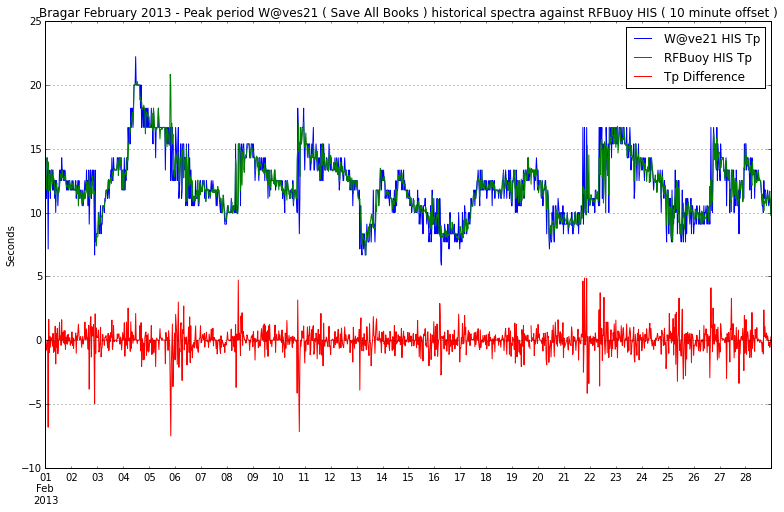
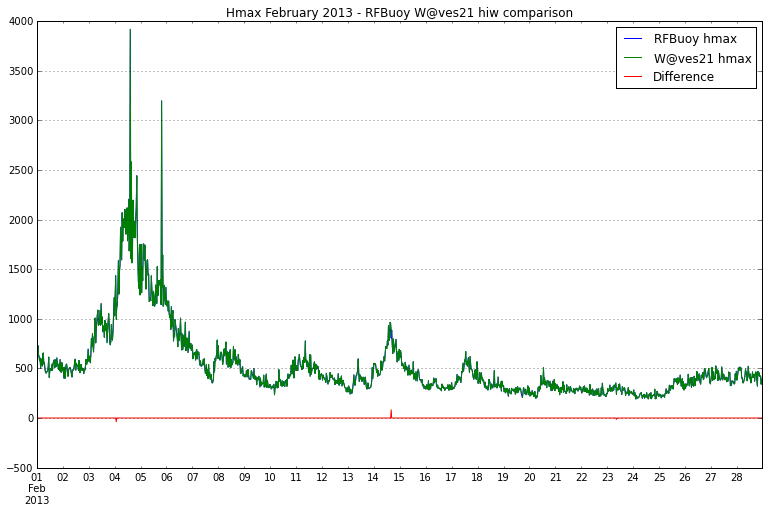
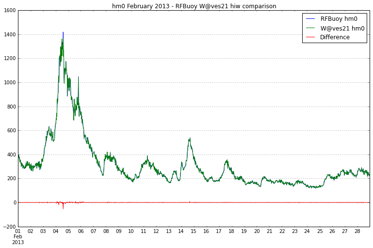
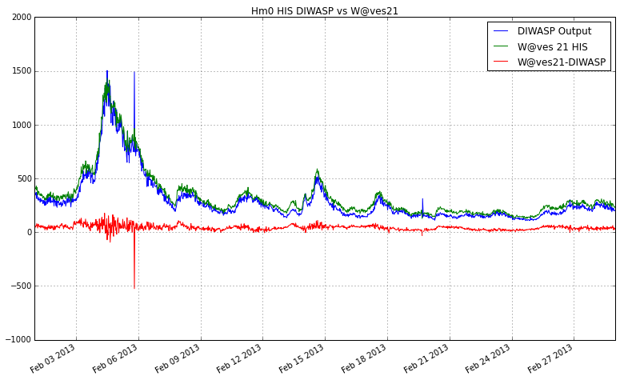
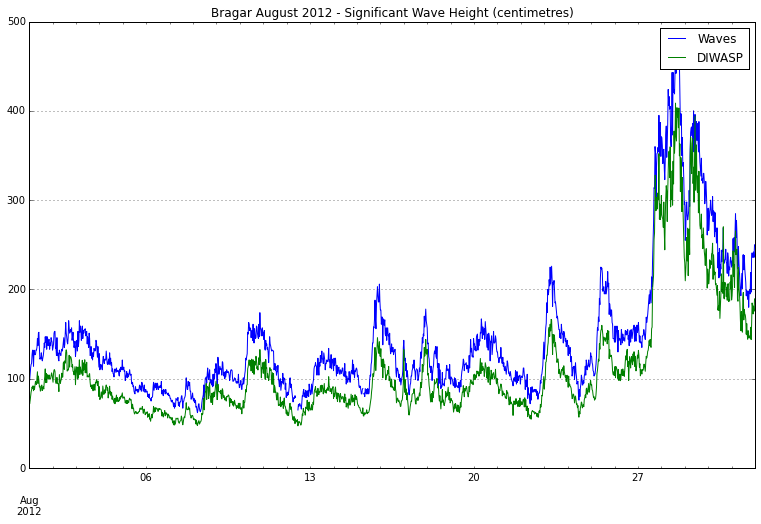
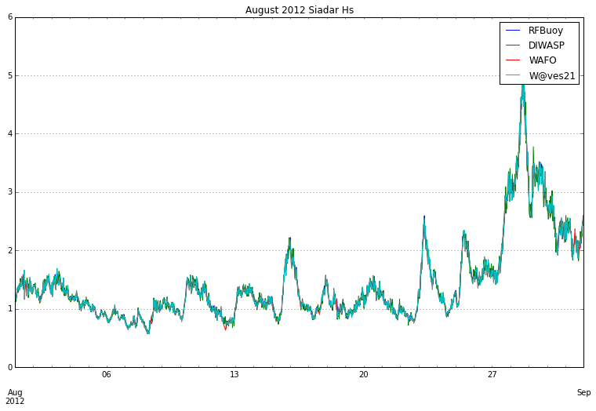
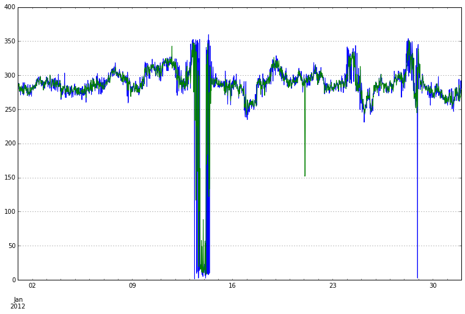
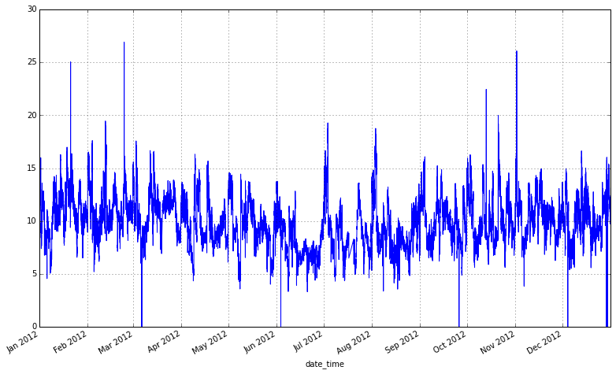

.. code:: python

    %pylab inline

.. parsed-literal::

    Populating the interactive namespace from numpy and matplotlib
    
    

.. code:: python

    figsize(15,10)
.. code:: python

    import pandas as pd
.. code:: python

    from datetime import datetime
    from datetime import datetime as date_time
.. code:: python

    from scipy.stats.stats import pearsonr
.. code:: python

    his_columns = ['date_time', 'tp', 'dirp', 'sprp', 'tz', 'hm0', 'ti', 't1', 
                   'tc', 'tdw2', 'tdw1', 'tpc', 'nu','eps','qp','ss','tref','tsea',
                   'bat']
    
    hiw_columns = ['date_time','% no reception errors','hmax','tmax','h1_10',
                   't1_10','h1_3','t1_3','Hav','Tav','Eps','#Waves']
.. code:: python

    def apply_date_time_index(df):
        df = df[pd.notnull(df.date_time)]
        date_times = []        
        for index,date_time_string in enumerate(df['date_time'].values):
            if type(date_time_string) == type(''):
                date_time = datetime.strptime(date_time_string[:-5],
                                              "%Y-%m-%dT%H:%M:%S")
                date_times.append(date_time)
        df.index = pd.DatetimeIndex(date_times)
        return df
.. code:: python

    def process_hist(hist_df):
        hist_df = apply_date_time_index(hist_df)
        hist_df = hist_df.drop('date_time', axis = 1)
        hist_df = hist_df.resample('30Min')
        return hist_df
.. code:: python

    def read_hist_csv_and_time_index(filepath, columns= his_columns):
        his_df = pd.read_csv(filepath, names = columns)
        return process_hist(his_df)
.. code:: python

    # Reads in csv files output from Matlab DIWASP toolbox
    # and outputs timestamped Pandas Dataframes
    
    def read_diwasp_csv(file_path, date_format="%Y-%m-%dT%Hh%MZ"):
        """Function for reading csv files created by the write_csv.m matlab file
           which output file_names, Hm0 and peak period
        """
        df = pd.read_csv(file_path)
        date_time_array = []
        for date_time_string in df['file_name'].values:
            date_time_array.append(date_time.strptime(date_time_string[-21:-4],
                                                     date_format))
            
        df.index = pd.DatetimeIndex(date_time_array)
        return df
.. code:: python

    bragar_february_2013_rfbuoy_his = read_his_csv_and_time_index('D:\\Datawell\\Bragar_HebMarine2\\2013\\February\\Bragar_HebMarine2$}2013-02.his')
    bragar_february_2013_waves_21_his = read_his_csv_and_time_index('D:\\Profiles\\le12jm\\My Documents\\toolbox-comparison-paper\\data\\W@ves21_exported_save_all_books\\Bragar_HebMarine2$}2013-02.his')
The above plot shows that there are spikes of up to 5 metres in this
case where using the default his files would indicate a higher hm0.

There are also points at which the w@ves 21 exported his indicates a
higher hm0 this could be an effect of time shifting.

.. code:: python

    plt.figure()
    bragar_february_2013_waves_21_his.tp.plot()
    bragar_february_2013_rfbuoy_his.tp.plot()
    (bragar_february_2013_waves_21_his.tp - bragar_february_2013_rfbuoy_his.tp).plot()
    plt.legend(['W@ve21 HIS Tp','RFBuoy HIS Tp','Tp Difference'])
    plt.title('Bragar February 2013 - Peak period W@ves21 ( Save All Books ) historical spectra against RFBuoy HIS ( 10 minute offset )')
    plt.ylabel('Seconds')

.. parsed-literal::

    <matplotlib.text.Text at 0x1bfb3208>

Some of the spikes can be accounted for by the offset, where there are
corresponding spikes in both directions. This could be accounted for by
taking the timeseries in pandas and outputting modified raw files which
match the timestamps which are provided for in the RFBuoy HIS file.

.. code:: python

    waves_21_hiw = read_hist_csv_and_time_index('D:\\Profiles\\le12jm\\My Documents\\toolbox-comparison-paper\\data\\Bragar_HebMarine2}2013-02.hiw',
                                                hiw_columns)
.. code:: python

    rfbuoy_hiw = read_hist_csv_and_time_index('D:\\Datawell\\Bragar_HebMarine2\\2013\\February\\Bragar_HebMarine2}2013-02.hiw', 
                                              hiw_columns)
.. code:: python

    plt.figure()
    rfbuoy_hiw.hmax.plot()
    waves_21_hiw.hmax.plot()
    (waves_21_hiw.hmax - rfbuoy_hiw.hmax).plot()
    plt.legend(['RFBuoy hmax','W@ves21 hmax','Difference'])
    plt.title('Hmax February 2013 - RFBuoy W@ves21 hiw comparison')

.. parsed-literal::

    <matplotlib.text.Text at 0x1f33af60>

.. code:: python

    plt.figure()
    rfbuoy_hiw.h1_3.plot()
    waves_21_hiw.h1_3.plot()
    (waves_21_hiw.h1_3 - rfbuoy_hiw.h1_3).plot()
    plt.legend(['RFBuoy hm0','W@ves21 hm0','Difference'])
    plt.title('hm0 February 2013 - RFBuoy W@ves21 hiw comparison')

.. parsed-literal::

    <matplotlib.text.Text at 0x1fb1a320>

.. code:: python

    bragar_2013_feb_diwasp = read_diwasp_csv('D:\\Profiles\\le12jm\\My Documents\\toolbox-comparison-paper\\data\\small_freq_complex_masked_file_paramters.csv')
    #diwasp_output = read_csv('D:\\Profiles\\le12jm\\My Documents\\toolbox-comparison-paper\\data\\siadar_complex_masked_file_parameters.csv')
.. code:: python

    plt.figure(figsize(13,8))
    (bragar_2013_feb_diwasp.Hm0*100).plot()
    bragar_february_2013_waves_21_his.hm0.plot()
    (bragar_february_2013_waves_21_his.hm0 - (bragar_2013_feb_diwasp.Hm0 * 100)).plot()
    plt.legend(['DIWASP Output','W@ves 21 HIS','W@ves21-DIWASP'])
    plt.title('Hm0 HIS DIWASP vs W@ves21')
    

.. parsed-literal::

    <matplotlib.text.Text at 0x203c5c50>

The diwasp output under predicts against the W@ves21 output aside from
certain data points at the peak of the storm. What artefacts cause this?
The data for that timestamp

.. code:: python

    bragar_2013_feb_diwasp_Hm0_centimetres = bragar_2013_feb_diwasp.Hm0 * 100
    print "Largest negative difference of Significant Wave Height February Bragar 2013 - W@ves21 minus DIWASP"
    (bragar_february_2013_waves_21_his.hm0 - bragar_2013_feb_diwasp_Hm0_centimetres)[(waves_21_his.hm0 - bragar_2013_feb_diwasp_Hm0_centimetres)==(waves_21_his.hm0 - bragar_2013_feb_diwasp_Hm0_centimetres).min()]

.. parsed-literal::

    Largest negative difference of Significant Wave Height February Bragar 2013 - W@ves21 minus DIWASP
    

.. parsed-literal::

    2013-02-05 19:30:00   -525.7892
    dtype: float64

.. code:: python

    print "Scatter Index - RMS over mean - "
    np.sqrt((bragar_february_2013_waves_21_his.hm0 - bragar_2013_feb_diwasp_Hm0_centimetres) ** 2).mean()/bragar_february_2013_waves_21_his.hm0.mean()

.. parsed-literal::

    Scatter Index - RMS over mean - 
    

.. parsed-literal::

    0.12798443283898586

.. code:: python

    print "Pearson values from resampled Bragar 2013 Significant wave heights"
    print pearsonr(bragar_february_2013_waves_21_his.hm0.resample('30Min'), bragar_2013_feb_diwasp_Hm0.resample('30Min'))
    print np.corrcoef(bragar_february_2013_waves_21_his.hm0.resample('30Min').values, bragar_2013_feb_diwasp_Hm0.resample('30Min').values)

.. parsed-literal::

    Pearson values from resampled Bragar 2013 Significant wave heights
    (nan, 1.0)
    [[ nan  nan]
     [ nan   1.]]
    

.. code:: python

    august_2012_diwasp_output = read_diwasp_csv('D:\\Profiles\\le12jm\\My Documents\\toolbox-comparison-paper\\data\\bragar_august_2012.csv')
    august_2012_bragar_waves_21_his = read_hist_csv_and_time_index('D:\\Profiles\\le12jm\\My Documents\\toolbox-comparison-paper\\data\\Bragar_HebMarine2$}2012-08.his')
.. code:: python

    august_2012_bragar_waves_21_his.hm0.plot()
    (august_2012_diwasp_output * 100 ).Hm0.plot()
    plt.legend(['Waves','DIWASP'])
    plt.title('Bragar August 2012 - Significant Wave Height (centimetres)')

.. parsed-literal::

    <matplotlib.text.Text at 0x1a6efa20>

.. code:: python

    def rms_hm0(diwasp,waves):
        diwasp_hm0 = diwasp.Hm0 * 100 
        return np.sqrt((waves.hm0 - diwasp_hm0) ** 2).mean()/waves.hm0.mean()
.. code:: python

    rms_hm0(august_2012_diwasp_output, august_2012_bragar_waves_21_his)

.. parsed-literal::

    0.23580569297412493

.. code:: python

    august_2012_diwasp_output.index.difference(august_2012_bragar_waves_21_his.index)

.. parsed-literal::

    <class 'pandas.tseries.index.DatetimeIndex'>
    [2012-08-27 17:44:00]
    Length: 1, Freq: None, Timezone: None

.. code:: python

    august_2012_diwasp_output.ix[datetime(2012,8,27,17):datetime(2012,8,27,18)]

.. raw:: html

    

    <table border="1" class="dataframe">
      <thead>
        <tr style="text-align: right;">
          <th></th>
          <th>file_name</th>
          <th>Hm0</th>
          <th>peak_period</th>
          <th>mean_dir_pp</th>
          <th>sig_qual_sum</th>
          <th>energy_period</th>
        </tr>
      </thead>
      <tbody>
        <tr>
          <th>2012-08-27 17:00:00</th>
          <td> Bragar_HebMarine2}2012-08-27T17h00Z.raw</td>
          <td> 2.635557</td>
          <td> 12.500000</td>
          <td> 233.610155</td>
          <td> 0</td>
          <td> 9.322102</td>
        </tr>
        <tr>
          <th>2012-08-27 17:30:00</th>
          <td> Bragar_HebMarine2}2012-08-27T17h30Z.raw</td>
          <td> 3.066969</td>
          <td> 13.333333</td>
          <td> 242.614520</td>
          <td> 0</td>
          <td> 9.681821</td>
        </tr>
        <tr>
          <th>2012-08-27 17:44:00</th>
          <td> Bragar_HebMarine2}2012-08-27T17h44Z.raw</td>
          <td> 3.280173</td>
          <td> 10.526316</td>
          <td> 235.184029</td>
          <td> 0</td>
          <td> 9.352168</td>
        </tr>
        <tr>
          <th>2012-08-27 18:00:00</th>
          <td> Bragar_HebMarine2}2012-08-27T18h00Z.raw</td>
          <td> 3.044029</td>
          <td> 10.526316</td>
          <td> 240.575615</td>
          <td> 0</td>
          <td> 9.293356</td>
        </tr>
      </tbody>
    </table>
    

.. code:: python

    august_2012_bragar_waves_21_his.ix[datetime(2012,8,27,17):datetime(2012,8,27,18)]

.. raw:: html

    

    <table border="1" class="dataframe">
      <thead>
        <tr style="text-align: right;">
          <th></th>
          <th>tp</th>
          <th>dirp</th>
          <th>sprp</th>
          <th>tz</th>
          <th>hm0</th>
          <th>ti</th>
          <th>t1</th>
          <th>tc</th>
          <th>tdw2</th>
          <th>tdw1</th>
          <th>tpc</th>
          <th>nu</th>
          <th>eps</th>
          <th>qp</th>
          <th>ss</th>
          <th>tref</th>
          <th>tsea</th>
          <th>bat</th>
        </tr>
      </thead>
      <tbody>
        <tr>
          <th>2012-08-27 17:00:00</th>
          <td> 12.50</td>
          <td> 233.5</td>
          <td> 19.7</td>
          <td> 6.73</td>
          <td> 313</td>
          <td> 9.81</td>
          <td> 7.69</td>
          <td> 3.76</td>
          <td> 8.44</td>
          <td> 10.34</td>
          <td> 12.52</td>
          <td> 0.555</td>
          <td> 0.829</td>
          <td> 1.829</td>
          <td> 0.044</td>
          <td> 0</td>
          <td> 0</td>
          <td> 0</td>
        </tr>
        <tr>
          <th>2012-08-27 17:30:00</th>
          <td> 10.53</td>
          <td> 231.2</td>
          <td> 26.3</td>
          <td> 6.74</td>
          <td> 360</td>
          <td> 9.46</td>
          <td> 7.58</td>
          <td> 3.95</td>
          <td> 8.24</td>
          <td> 10.04</td>
          <td> 11.81</td>
          <td> 0.515</td>
          <td> 0.811</td>
          <td> 1.980</td>
          <td> 0.051</td>
          <td> 0</td>
          <td> 0</td>
          <td> 0</td>
        </tr>
        <tr>
          <th>2012-08-27 18:00:00</th>
          <td> 10.53</td>
          <td> 236.7</td>
          <td> 26.1</td>
          <td> 6.89</td>
          <td> 353</td>
          <td> 9.59</td>
          <td> 7.72</td>
          <td> 4.09</td>
          <td> 8.36</td>
          <td>  9.82</td>
          <td> 11.91</td>
          <td> 0.502</td>
          <td> 0.805</td>
          <td> 1.848</td>
          <td> 0.048</td>
          <td> 0</td>
          <td> 0</td>
          <td> 0</td>
        </tr>
      </tbody>
    </table>
    

If there are multiple files in one 30 minute period, as above for 17:44,
W@ves21 only provides one value which I believe only consists of one of
those files the last is my guess

.. code:: python

    august_2012_diwasp_output_resampled = august_2012_diwasp_output.resample('30Min')
.. code:: python

    siadar_2013_august_waves_21_his = read_hist_csv_and_time_index('D:\\Profiles\\le12jm\\My Documents\\toolbox-comparison-paper\\data\\Bragar_HebMarine2$}2012-08.his')
.. code:: python

    siadar_2013_august_waves_21_his.ix[datetime(2012,8,9):datetime(2012,8,9,1)]

.. raw:: html

    

    <table border="1" class="dataframe">
      <thead>
        <tr style="text-align: right;">
          <th></th>
          <th>date_time</th>
          <th>tp</th>
          <th>dirp</th>
          <th>sprp</th>
          <th>tz</th>
          <th>hm0</th>
          <th>ti</th>
          <th>t1</th>
          <th>tc</th>
          <th>tdw2</th>
          <th>tdw1</th>
          <th>tpc</th>
          <th>nu</th>
          <th>eps</th>
          <th>qp</th>
          <th>ss</th>
          <th>tref</th>
          <th>tsea</th>
          <th>bat</th>
        </tr>
      </thead>
      <tbody>
        <tr>
          <th>2012-08-09 00:00:00</th>
          <td> 2012-08-09T00:00:00.000</td>
          <td> 10.00</td>
          <td> 296.4</td>
          <td> 31.6</td>
          <td> 6.42</td>
          <td> 111</td>
          <td> 8.78</td>
          <td> 7.31</td>
          <td> 3.40</td>
          <td> 7.85</td>
          <td> 10.35</td>
          <td> 10.56</td>
          <td> 0.541</td>
          <td> 0.849</td>
          <td> 2.464</td>
          <td> 0.017</td>
          <td> 0</td>
          <td> 0</td>
          <td> 0</td>
        </tr>
        <tr>
          <th>2012-08-09 00:30:00</th>
          <td> 2012-08-09T00:30:00.000</td>
          <td> 10.53</td>
          <td> 276.6</td>
          <td> 21.6</td>
          <td> 5.59</td>
          <td>  92</td>
          <td> 8.58</td>
          <td> 6.61</td>
          <td> 2.86</td>
          <td> 7.32</td>
          <td> 10.24</td>
          <td> 11.13</td>
          <td> 0.630</td>
          <td> 0.859</td>
          <td> 2.414</td>
          <td> 0.019</td>
          <td> 0</td>
          <td> 0</td>
          <td> 0</td>
        </tr>
        <tr>
          <th>2012-08-09 01:00:00</th>
          <td> 2012-08-09T01:00:00.000</td>
          <td> 10.00</td>
          <td> 286.2</td>
          <td> 27.0</td>
          <td> 5.43</td>
          <td>  95</td>
          <td> 8.40</td>
          <td> 6.43</td>
          <td> 2.84</td>
          <td> 7.14</td>
          <td>  9.99</td>
          <td> 10.97</td>
          <td> 0.633</td>
          <td> 0.852</td>
          <td> 2.311</td>
          <td> 0.021</td>
          <td> 0</td>
          <td> 0</td>
          <td> 0</td>
        </tr>
      </tbody>
    </table>
    

.. code:: python

    bragar_his_august_2012_rfbuoy = read_hist_csv_and_time_index('D:\\Datawell\\Bragar_HebMarine2\\2012\\August\\Bragar_HebMarine2$}2012-08.his')
    siadar_august_2012_diwasp_output = read_diwasp_csv('D:\\Profiles\\le12jm\\My Documents\\toolbox-comparison-paper\\data\\siadar_august_2012.csv')
    siadar_his_august_2012_rfbuoy = read_hist_csv_and_time_index('D:\\Datawell\\Siadar_HebMarine1\\2012\\August\\Siadar_HebMarine1$}2012-08.his')
    siadar_august_2012_waves21 = read_hist_csv_and_time_index('D:\\Profiles\\le12jm\\My Documents\\toolbox-comparison-paper\\data\\Siadar_HebMarine1$}2012-08.his')
.. code:: python

    siadar_2012 = pd.read_pickle('C:\Users\le12jm\David_2012_Siadar_WAFO')
.. code:: python

    siadar_2012_august_wafo = siadar_2012.ix[datetime(2012,8,1,0):datetime(2012,9,1,0)]
.. code:: python

    plt.figure()
    (siadar_his_august_2012_rfbuoy/100.0).hm0.plot()
    siadar_august_2012_diwasp_output.Hm0.plot()
    siadar_2012_august_wafo.Hs.plot()
    (siadar_august_2012_waves21.hm0/100.0).plot()
    plt.legend(['RFBuoy','DIWASP','WAFO','W@ves21'])
    plt.title('August 2012 Siadar Hs')

.. parsed-literal::

    <matplotlib.text.Text at 0x19665860>

.. code:: python

    diff_siadar_august_his_diwasp = (siadar_his_august_2012_rfbuoy/100.0).hm0 - siadar_august_2012_diwasp_output.Hm0
    diff_siadar_august_wafo_diwasp = siadar_2012_august_wafo.Hs - siadar_august_2012_diwasp_output.Hm0
    diff_siadar_august_wafo_his = siadar_2012_august_wafo.Hs - (siadar_his_august_2012_rfbuoy/100.0).hm0
    diff_siadar_august_wafo_waves21 =  siadar_2012_august_wafo.Hs - (siadar_august_2012_waves21/100.0).hm0
.. code:: python

    print "Difference between Significant Sidar August 2012"
    his_wafo_diwasp_descriptions = pd.DataFrame([diff_siadar_august_his_diwasp.describe(), diff_siadar_august_wafo_diwasp.describe(),
                                                 diff_siadar_august_wafo_his.describe(), diff_siadar_august_wafo_waves21.describe()])
    his_wafo_diwasp_descriptions.index =  ['HIS - DIWASP', 'WAFO - DIWASP', 'WAFO - HIS', 'WAFO - W@VES21']
    print his_wafo_diwasp_descriptions

.. parsed-literal::

    Difference between Significant Sidar August 2012
                    count      mean       std       min       25%       50%  \
    HIS - DIWASP     1455  0.001650  0.069195 -0.503595 -0.028592  0.002158   
    WAFO - DIWASP     484 -0.003648  0.075439 -0.378972 -0.035252 -0.004494   
    WAFO - HIS        484 -0.001221  0.066235 -0.244505 -0.038938 -0.003037   
    WAFO - W@VES21    484  0.000281  0.002864 -0.004980 -0.002100  0.000575   
    
                         75%       max  
    HIS - DIWASP    0.033824  0.335032  
    WAFO - DIWASP   0.030124  0.427863  
    WAFO - HIS      0.032448  0.399695  
    WAFO - W@VES21  0.002747  0.004920  
    

.. code:: python

    def scatter_index(time_series1,time_series2):
        return np.sqrt((time_series1 - time_series2) ** 2).mean()/time_series2.mean()
.. code:: python

    rms_results = [ ('RFBuoy - DIWASP', scatter_index((siadar_his_august_2012_rfbuoy/100.0).hm0, siadar_august_2012_diwasp_output.Hm0)),
                    ('WAFO - DIWASP', scatter_index(siadar_2012_august_wafo.Hs, siadar_august_2012_diwasp_output.Hm0)),
                    ('WAFO - RfBuoy', scatter_index(siadar_2012_august_wafo.Hs, (siadar_his_august_2012_rfbuoy/100.0).hm0)),
                    ('W@ves21 - RfBuoy', scatter_index((siadar_august_2012_waves21.hm0/100.0), (siadar_his_august_2012_rfbuoy/100.0).hm0)),
                    ('W@ves21 - WAFO', scatter_index((siadar_august_2012_waves21.hm0/100.0), siadar_2012_august_wafo.Hs)),
                    ('W@ves21 - DIWASP', scatter_index((siadar_august_2012_waves21.hm0/100.0), siadar_august_2012_diwasp_output.Hm0))]
    rms_df = pd.DataFrame(rms_results, columns=['Title','Scatter Index'])
.. code:: python

    print "Siadar August 2012 significant wave heights scatter indexes"
    rms_df

.. parsed-literal::

    Siadar August 2012 significant wave heights scatter indexes
    

.. raw:: html

    

    <table border="1" class="dataframe">
      <thead>
        <tr style="text-align: right;">
          <th></th>
          <th>Title</th>
          <th>Scatter Index</th>
        </tr>
      </thead>
      <tbody>
        <tr>
          <th>0</th>
          <td>  RFBuoy - DIWASP</td>
          <td> 0.033071</td>
        </tr>
        <tr>
          <th>1</th>
          <td>    WAFO - DIWASP</td>
          <td> 0.035339</td>
        </tr>
        <tr>
          <th>2</th>
          <td>    WAFO - RfBuoy</td>
          <td> 0.032917</td>
        </tr>
        <tr>
          <th>3</th>
          <td> W@ves21 - RfBuoy</td>
          <td> 0.031497</td>
        </tr>
        <tr>
          <th>4</th>
          <td>   W@ves21 - WAFO</td>
          <td> 0.001738</td>
        </tr>
        <tr>
          <th>5</th>
          <td> W@ves21 - DIWASP</td>
          <td> 0.033966</td>
        </tr>
      </tbody>
    </table>
    

.. code:: python

    siadar_2012_january_wafo = siadar_2012.ix[datetime(2012,1,1,0):datetime(2012,2,1,0)]
.. code:: python

    # Import historical his files produced by RFBuoy and Exported from RAW files in W@ves21
    siadar_january_2012_waves21 = read_his_csv_and_time_index('D:\\Profiles\\le12jm\\My Documents\\toolbox-comparison-paper\\data\\Siadar_HebMarine1$}2012-01.his')
    siadar_january_2012_rfbuoy = read_his_csv_and_time_index('D:\\Datawell\\Siadar_HebMarine1\\2012\\January\\Siadar_HebMarine1$}2012-01.his')
.. code:: python

    siadar_january_2012_waves21.dirp.plot()
    siadar_january_2012_rfbuoy.dirp.plot()

.. parsed-literal::

    <matplotlib.axes._subplots.AxesSubplot at 0x1fb0fac8>

.. code:: python

    siadar_2012_january_wafo.columns

.. parsed-literal::

    Index([u'Hs', u'Tz'], dtype='object')

.. code:: python

    siadar_2012_df = pd.read_csv('F:\\David_Dirp_Spread_peak_frequency_2012.csv', names=['date_time','direction','spread'],
                                 parse_dates=True, infer_datetime_format=True, index_col=0)
.. code:: python

    siadar_2012_df.direction.plot(title="Direction over time)

.. parsed-literal::

    <matplotlib.axes._subplots.AxesSubplot at 0x24534c88>

